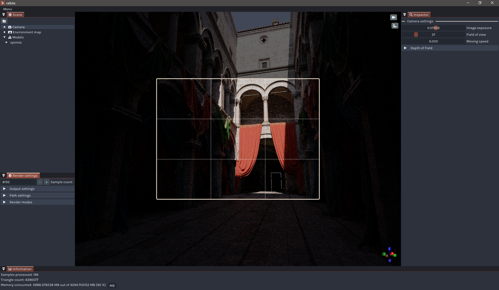
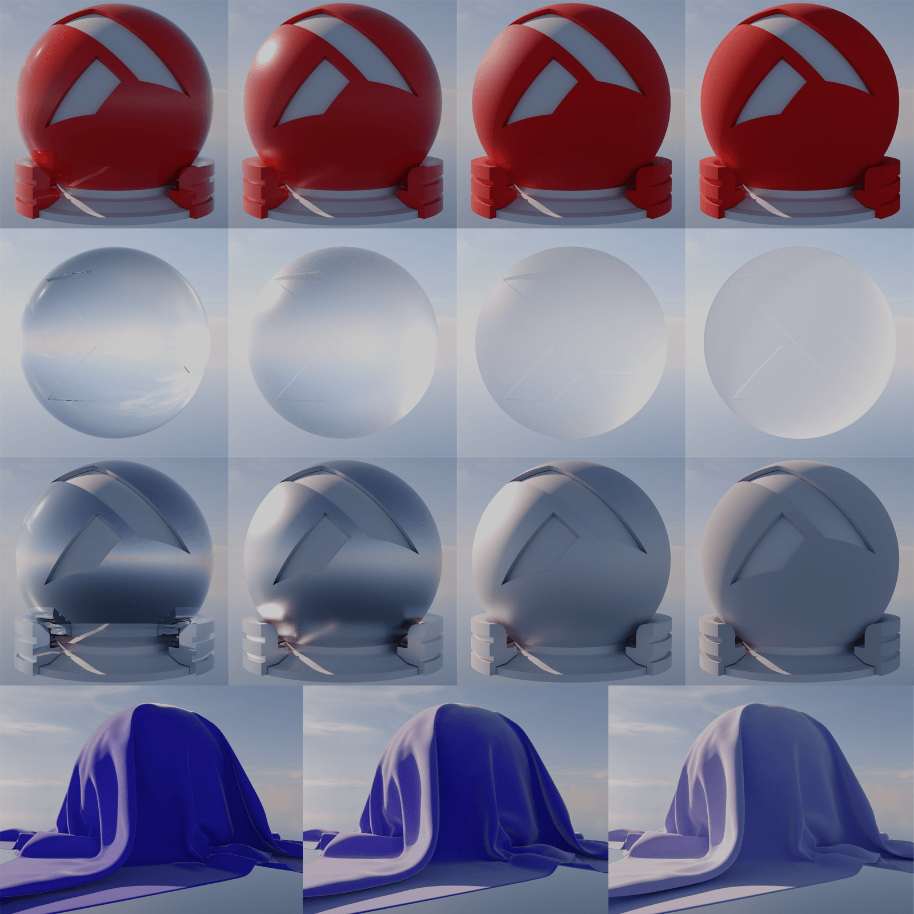
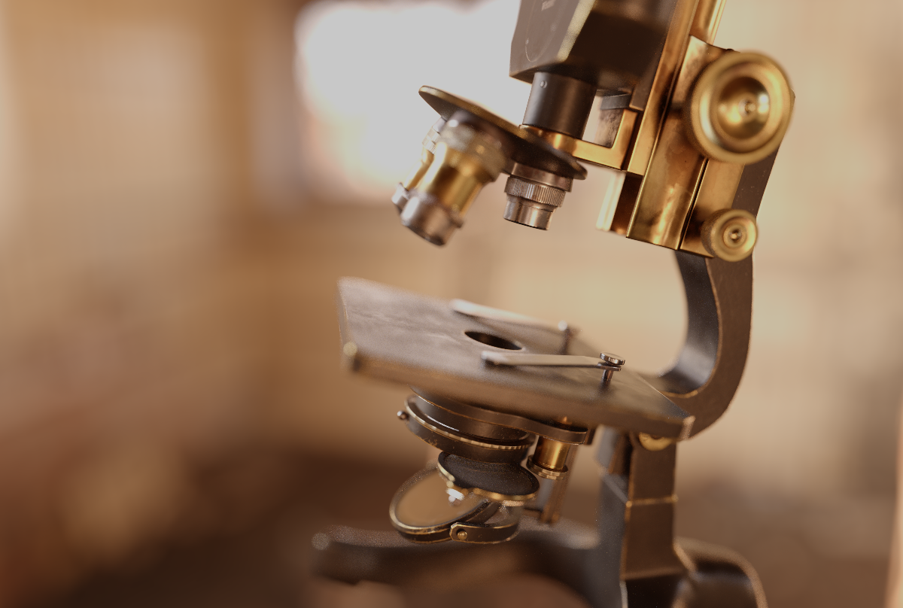
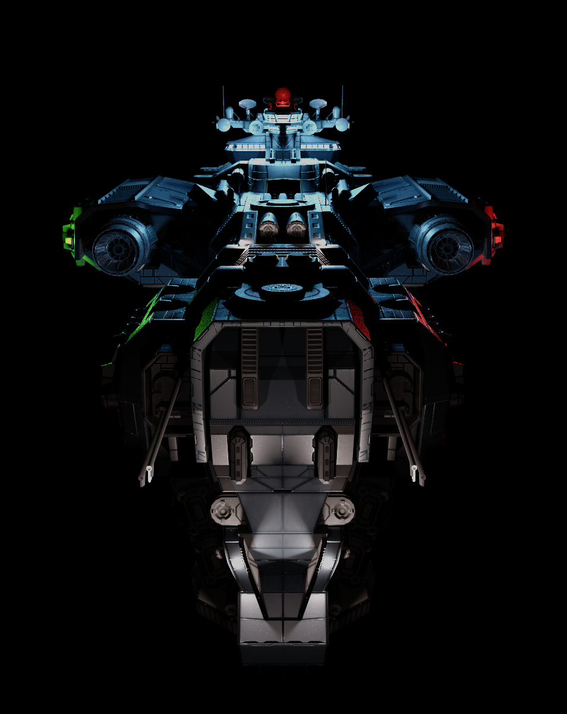
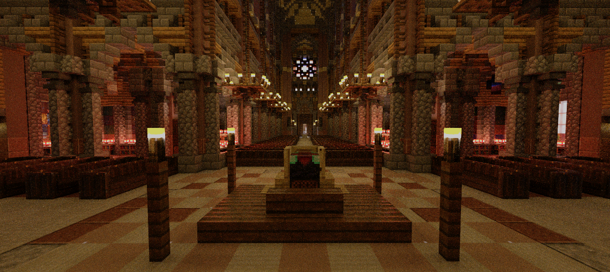
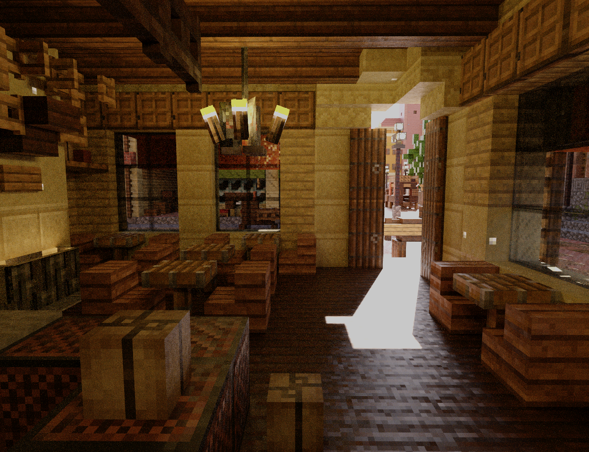
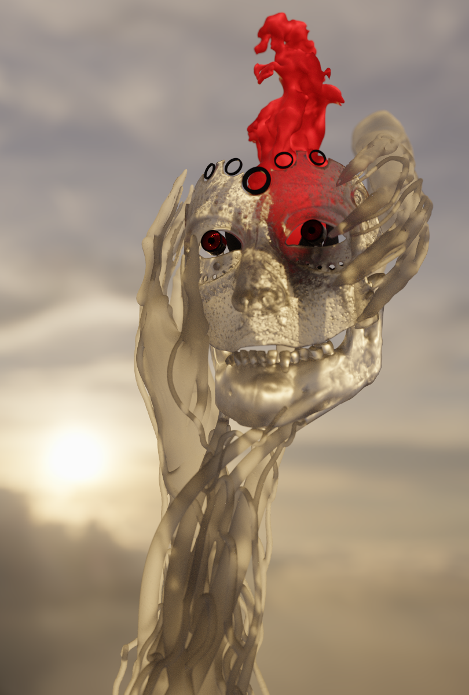
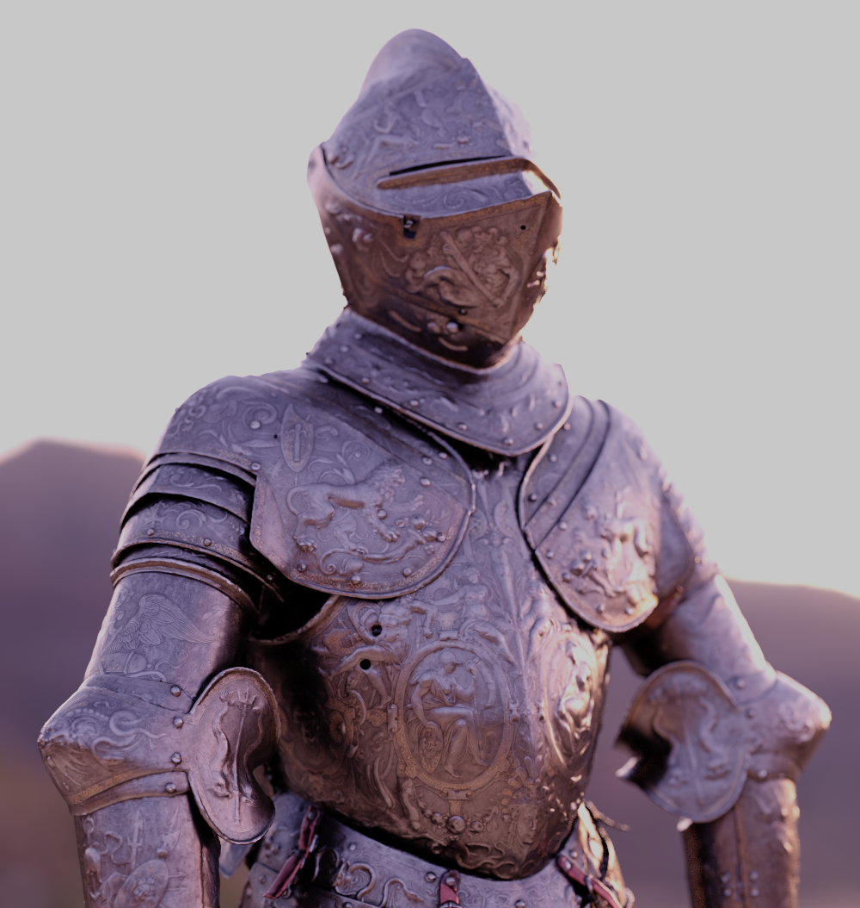
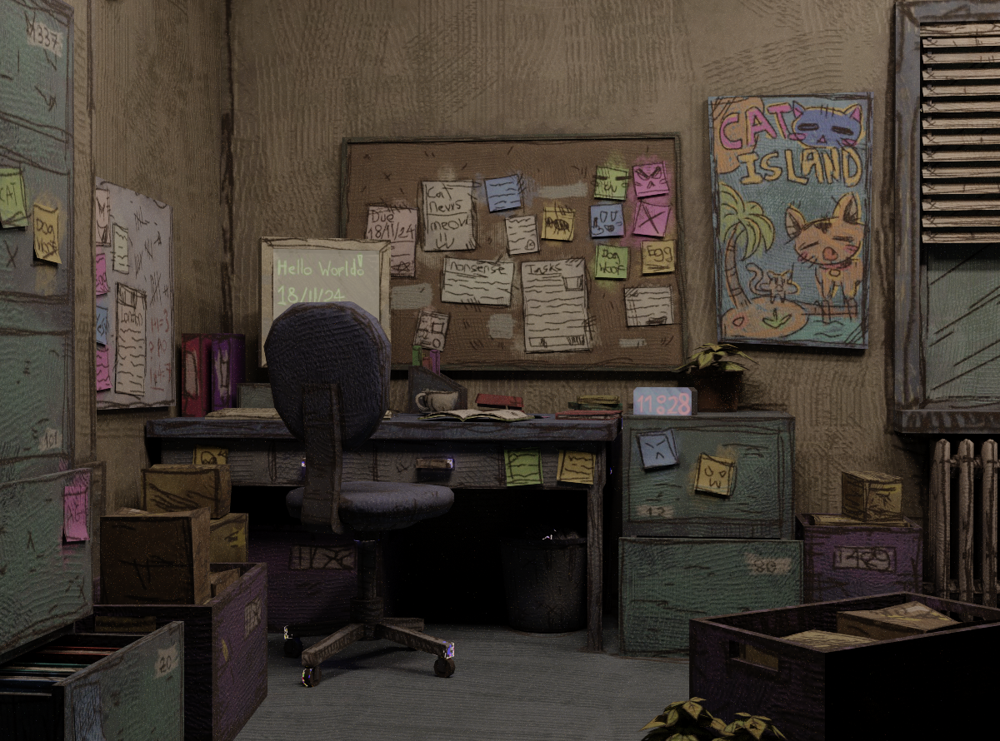

Spectral Monte Carlo Path Tracer[^1] written in C++ with OptiX and CUDA  

### Feature list
* OpenPBR BxDF (WIP)[^2]
  * Glossy-Diffuse
  * Translucent
  * Metal
  * Fuzz (Sheen)[^3]
* Textured polygonal lights using a Gaussian Light Tree[^4]
* Hero Wavelength spectral sampling[^5]
* Environment map importance sampling[^6]
* GLTF/GLB support
* Multiple scattering compensation[^7]
* Sampling of visible normals[^8]
* Multiple Importance Sampling
* Next Event Estimation
* Depth of Field
* Low-discrepancy sequence generation
* ImGui interface with export and render utilities

### Examples ([Showcase Video](https://youtu.be/WYM2YJnsO-w))

###### Credits: [Sponza](https://www.intel.com/content/www/us/en/developer/topic-technology/graphics-research/samples.html), [Microscope](https://sketchfab.com/3d-models/game-ready-pbr-microscope-a4d9a0fbe5d844769c1865d7b9a6ad9d), [Spaceship](https://sketchfab.com/3d-models/dss-harbinger-battle-cruiser-474f62d00ed54212b37f93ce91569c53), [Plaza](https://sketchfab.com/3d-models/plaza-night-time-282f497334f64a589edee4e63ad7e428), [Titan](https://sketchfab.com/3d-models/titan-646952b9348443c0892672204ab3779c), [Armor](https://sketchfab.com/3d-models/the-parade-armour-of-king-erik-xiv-of-sweden-bd189bba7d9e4924b12826a6d68200d9), [Office](https://sketchfab.com/3d-models/late-night-office-29986085d4a6477c9dda61e63327bdfc)

[^1]: [Physically Based Rendering: From Theory To Implementation. Fourth edition.](https://pbr-book.org/4ed/contents)
[^2]: [OpenPBR surface](https://academysoftwarefoundation.github.io/OpenPBR/)
[^3]: [Practical Multiple-Scattering Sheen Using Linearly Transformed Cosines](https://tizianzeltner.com/projects/Zeltner2022Practical/sheen.pdf)
[^4]: [Hierarchical Light Sampling with Accurate Spherical Gaussian Lighting](https://gpuopen.com/download/publications/Hierarchical_Light_Sampling_with_Accurate_Spherical_Gaussian_Lighting.pdf)
[^5]: [Hero Wavelength Spectral Sampling](https://cgg.mff.cuni.cz/~wilkie/Website/EGSR_14_files/WNDWH14HWSS.pdf)
[^6]: [About fast 2D CDF construction](https://maxliani.wordpress.com/2024/03/09/about-fast-2d-cdf-construction/)
[^7]: [Practical multiple scattering compensation for microfacet models](https://blog.selfshadow.com/publications/turquin/ms_comp_final.pdf)
[^8]: [Sampling Visible GGX Normals with Spherical Caps](https://arxiv.org/pdf/2306.05044)
